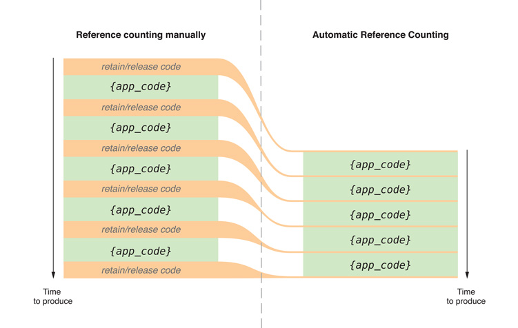

# ARC 與 MRC

### 寫法區別

一張圖解釋 MRC 與 ARC 區別



來個例子，假設有個 Person 物件，包含一個 Car 屬性。

MRC的寫法:

```objectivec
#import "Person.h"
- (void)setCar:(Car *)car {
    //先檢查賦值對象，如果不同則要更新引用計數
    if (_car != car) {
        [_car release]; //釋放，引用計數 - 1
        _car = [car retain]; //持有新對象，計數 + 1
    }
}

- (void)dealloc {
    [_car release]; //在自己 release 之前，必須把持有的 _car 變量也銷毀。
    [super release];
}
```

ARC 則不須再去管 release 或 retain （事實上也不能調用），如下

```objectivec
#import "Person.h"
- (void)setCar:(Car *)car {
    if (_car != car) {
        _car = car; 
    }
}

- (void)dealloc {
    //所有 release 由編譯時自動執行
}
```

編譯器自動幫你判斷何時該持有與釋放，程序猿管好代碼邏輯即可。有木有聽起來很棒呢？

不過雖然我們可以省略 retain 與 release，還是要記得不管是 MRC or ARC，對於引用計數的原則的關鍵點就是「誰持有，誰釋放」。

另外，ARC 對於變量能使用的修飾符也和 MRC 略有不同。




